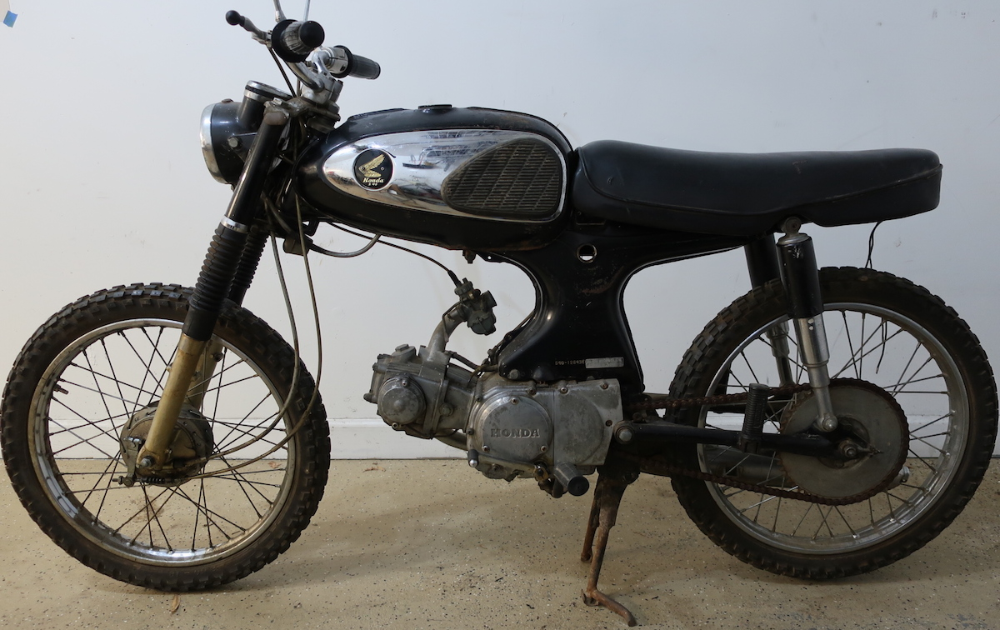
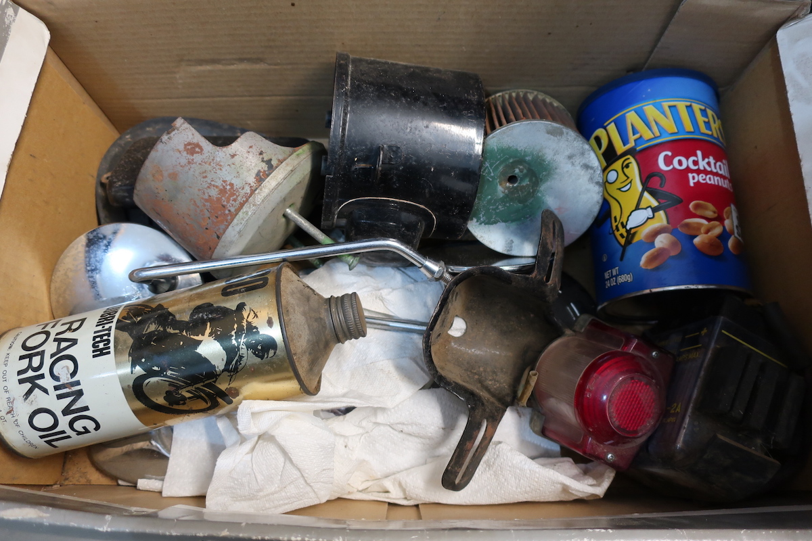
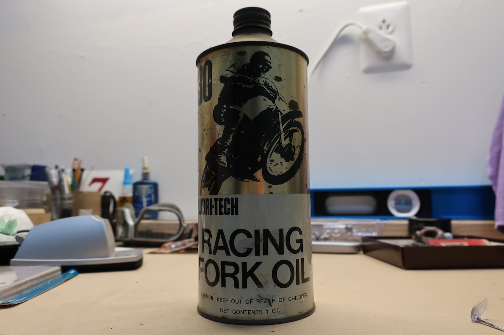
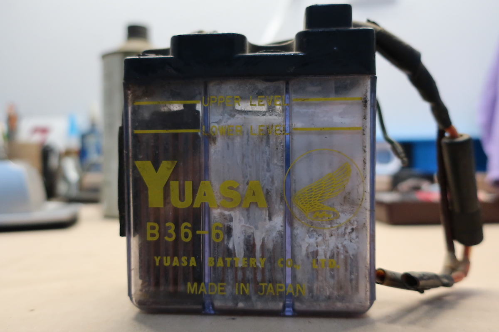

My dad's friend heard that I rebuild motorcycles so he gave this S90 to me.  It's somewhat of a rare find because it's a single owner with only 2,339 miles.  It was used on a farm (notice the off-road tires) which is why the miles are so low.  A bike used off-road gets beat up and this one is no exception, but I'm happy to take on the project.

Here's the state of it after looking over in detail.

|         |   |
| ------------- | :-----|
| Piston | crown is rusted  |
| Combustion chamber | rusted  |
| Transmission | won't stay in gear |
| Carburator | gummed up |
| Gas Tank | rusty inside and outside, one side has a big dent, missing cap  |
| Electrics | not working |
| Battery box | rusted  |
| Tires | good condition |
| Brakes      | solid, good stopping power |
| Keys      | missing      |
| Parts      | all original      |

Nothing is really broken... it just needs some love.  I got a box of goodies as well.  A couple things ended up being garage decorations like the old school fork oil (is that Steve McQueen?) and the Yuasa battery.

